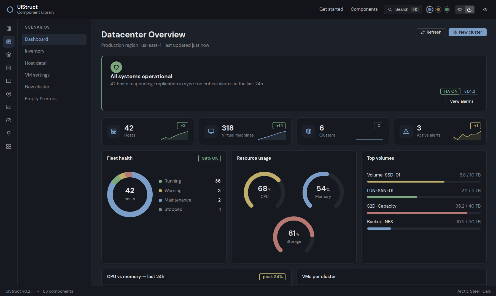
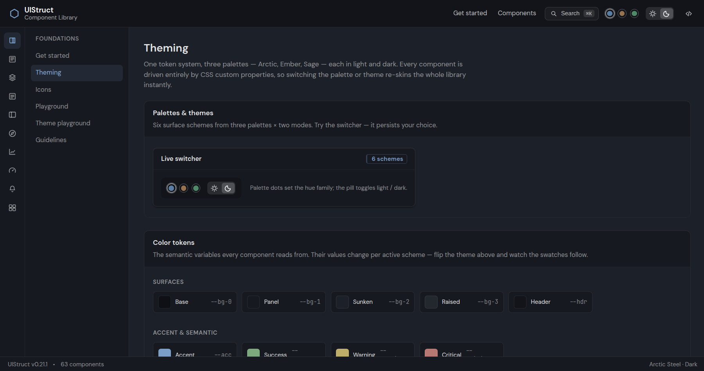

# UIStruct

[](https://www.npmjs.com/package/@akcelik/strct)
[](LICENSE)

A standalone Angular workspace containing **`@akcelik/strct`** — a reusable UI
component library — and a showcase application that documents it. Independent of
any other project. Built for **datacenter / infrastructure-management consoles**.

**70 components · 179 icons · 3 palettes × dark/light · zero runtime dependencies.**



- 📦 npm: [`@akcelik/strct`](https://www.npmjs.com/package/@akcelik/strct)
- 📚 Docs & live demos: <https://akcelik.github.io/uistruct/>

<details>
<summary><strong>More screenshots</strong> — theming foundations</summary>



</details>

The design system is **token-first**: one set of CSS custom properties, three
palettes (**Arctic / Ember / Sage**) each in **dark** and **light** — six surface
schemes in total. Every component reads from the token layer, so switching the
palette or theme re-skins the whole library instantly.

## Install (consumers)

```bash
npm install @akcelik/strct
```

Import the theme once in your global stylesheet:

```scss
@use '@akcelik/strct/styles/theme';
```

Inject `StrctThemeService` (it sets `data-palette` / `data-theme` on `<html>` and
persists the choice), then use standalone components directly:

```ts
import { StrctButton, StrctThemeService } from '@akcelik/strct';
```

```html
<button strct-button variant="primary" solid>Deploy</button>
```

## Workspace layout

```
projects/
├─ strct/        # the component library (selector prefix: strct)
│  └─ src/
│     ├─ styles/ # theme entry + tokens / base reset / form-control styles
│     └─ lib/    # components, grouped by area
└─ showcase/     # docs app — component pages, scenarios, playgrounds
```

## Develop

```bash
npm install
ng serve showcase        # run the showcase at http://localhost:4200
```

The showcase consumes the library straight from source (TypeScript path
mapping), so edits to `projects/strct` hot-reload without a separate build step.

## Build & test

```bash
ng build strct           # package the library (ng-packagr -> dist/strct)
ng build showcase        # build the demo app
ng test strct            # library unit tests
ng test showcase         # showcase unit tests
```

## The library

See [`projects/strct/README.md`](projects/strct/README.md) for the full theming
setup and usage examples. The component set, by area:

- **Layout** — shell, header, footer, vertical nav, icon nav, **rail** (collapsible icon navigation), login
- **Controls** — button, button group, speed dial, badge, tag, avatar, progress, spinner, skeleton
- **Surfaces** — card, accordion, tabs, tree, modal, **drawer** (edge-anchored panel), dropdown, context menu (+ submenu), wizard, divider
- **Navigation** — breadcrumb, pagination
- **Forms** — input directive, textarea, select, checkbox, toggle, radio group, slider, combobox, cascade select, date picker, password, file upload, color picker, rating, chips, input OTP, knob, input mask (all CVA-compatible)
- **Data** — table, datagrid (sort / select / expandable rows / detail pane / batch action bar / per-row kebab action menu / compact / paginate / resizable / column chooser / loading / sync), timeline, stack view
- **Charts** — sparkline, line/area/bar chart, donut, gauge (dependency-free SVG)
- **Feedback** — alert, tooltip, signpost, toast service + outlet
- **Foundations** — icon (datacenter icon set with status badges + vendor marks), theme service + switcher

## Showcase

A documentation site in the style of clarity.design / PrimeNG — per-component
pages with live examples, API tables and an on-this-page TOC, plus:

- **Scenarios** — realistic, vendor-neutral consoles: Dashboard, Inventory, Host
  detail, **VM settings** (a full master/detail settings editor), New cluster
  wizard, and Empty / error states.
- **Playgrounds** — an interactive props playground and a theme playground.
- **Guidelines** — UX patterns (destructive confirm, bulk select, toasts).
- **Command palette** — ⌘/Ctrl-K spotlight over every page.

## Accessibility & eye comfort

The theme is reviewed against WCAG and display-ergonomics / vision science to
limit eye strain during long, all-day console sessions:

- **WCAG AA text contrast** — all text tokens (`--t1/--t2/--t3`) **and all
  semantic text tones** (accent / success / warning / critical) meet AA (≥ 4.5:1)
  across every palette and mode, with a preserved `t1 > t2 > t3` hierarchy. Text on
  solid status fills uses the `--inv` token, keeping ≥ 4.5:1 in both modes.
- **OS-aware theming** — `StrctThemeService` follows the operating system's
  `prefers-color-scheme` until the user makes an explicit choice (which then wins
  and persists), so no one is forced onto a bright screen at night.
- **`prefers-contrast: more`** — strengthens borders, text and the focus ring when
  the OS asks; the default look is untouched otherwise.
- **`prefers-reduced-motion`** — every animation (charts, donut, flow, modal,
  drawer, toast, spinner) collapses to instant state changes; charts track the OS
  setting live.
- **Color-blind safe state badges** — icon status dots are shape-coded
  (✓ success · × critical · ! warning · i info · – off), and chart series can add a
  `dash` channel, so state never relies on hue alone.
- **Keyboard-complete** — tree (roving tabindex + arrow keys), charts (focusable
  crosshair with arrow keys + live announcements), donut legends, datagrid sort
  headers and all form controls are fully keyboard-operable.
- **12px type-size floor** with a 1.5 body line-height; softened (non-pure-white)
  light surfaces to cut glare.

## Conventions

- Component selectors and the library package use the `strct` prefix; class names
  use `Strct…`.
- Components never hard-code colors — only theme tokens (`var(--…)`); text on
  status fills uses `--inv`, header-anchored UI uses `--hdr-fg`.
- Styles use CSS logical properties (margin/padding/border-inline) for
  RTL-readiness; user-visible strings are overridable inputs for localization.
- Standalone components, signal inputs/outputs, `OnPush` change detection,
  zoneless-ready.

## Stability & support

UIStruct is **1.0 — a stability contract**, not just a version number:

- **Semver, for real.** Patches fix; minors are additive (new inputs default
  to previous behavior; visual changes are opt-in); majors are reserved for
  Angular major adoptions and rare breaking cleanups with migration notes.
  Deprecations live for at least one minor before removal. Details in
  [ROADMAP.md](ROADMAP.md).
- **A reviewed, frozen API.** The full public surface (327 signal members)
  was swept before 1.0; naming taxonomy and the few accepted deviations are
  documented in [docs/api-review.md](docs/api-review.md).
- **Security handling.** Private reporting channel, response expectations and
  supply-chain notes (zero runtime dependencies, npm provenance) are in
  [SECURITY.md](SECURITY.md).
- **Contributions.** House conventions and the PR checklist live in
  [CONTRIBUTING.md](CONTRIBUTING.md).
- **Continuity.** Single-maintainer today — mitigated by a small,
  dependency-free codebase that is easy to fork, and a fully scripted
  verification story (unit tests, an axe-core CI gate, reproducible
  benchmarks) that travels with the repo.
- **Measured performance.** The 20k-row datagrid numbers (22 `<tr>`s in the
  DOM, ~31 ms deep-scroll window swaps) and the script to reproduce them are
  in [docs/performance.md](docs/performance.md).

## License

[MIT](LICENSE) © Serkan Akçelik
